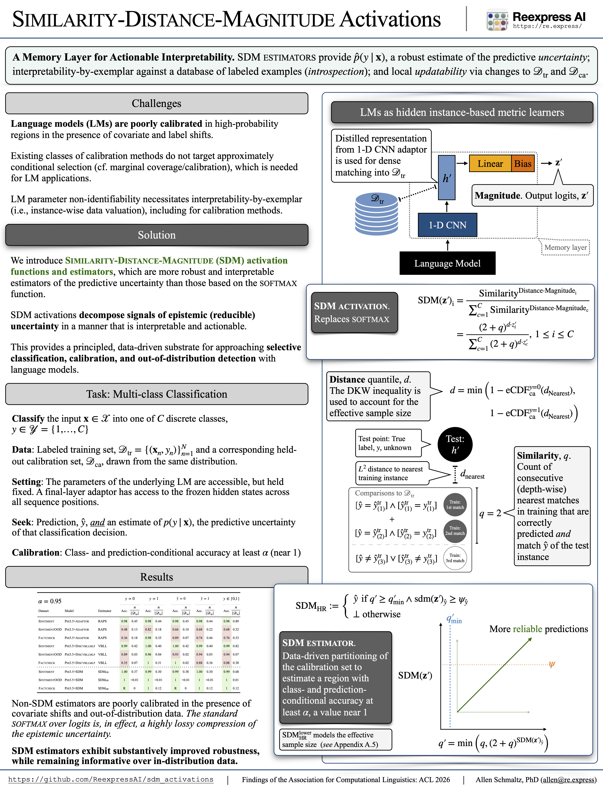

# Allen Schmaltz — SDM research reference

Source: [Allen Schmaltz’s homepage](https://allenschmaltz.github.io/). Retrieved September 10, 2026. This is a concise reference summary, not a verbatim archive of the website or its linked pages.

## Research overview

Schmaltz is a computer scientist and co-founder of [Reexpress AI](https://re.express/). His work develops Similarity-Distance-Magnitude (SDM) activations and uncertainty estimators for dependable AI.

SDM combines three signals: correctly predicted depth matches to training examples (Similarity), proximity to the training distribution (Distance), and decision-boundary information (Magnitude). The homepage expresses the activation as:

$$
\mathrm{SDM}(\mathbf{z})_i =
\frac{\mathrm{Similarity}^{\mathrm{Distance}\cdot\mathrm{Magnitude}_i}}
{\sum_{c=1}^{C}\mathrm{Similarity}^{\mathrm{Distance}\cdot\mathrm{Magnitude}_c}}.
$$

Its loss accounts for the example-dependent logarithm base. The research connects uncertainty estimation with exemplar-based inspection and local updates to decisions without retraining the whole model. The homepage traces this work through explanation modeling (2016), instance-based interpretations of networks (2021), and SDM estimators (2026).

## Papers and overview

- [Similarity-Distance-Magnitude Activations — ACL Findings 2026](https://doi.org/10.18653/v1/2026.findings-acl.1109)
- [Earlier explanation-modeling work — 2016](https://www.aclweb.org/anthology/W16-0528)
- [Hidden instance-based metric learners — 2021](https://doi.org/10.1162/coli_a_00416)
- [Video overview](https://youtu.be/bKswgsyRAPo)

## Poster attachment

[Open or download poster.png](assets/poster.png)

The attachment is an unmodified copy of the [poster linked from the homepage](https://raw.githubusercontent.com/ReexpressAI/sdm_activations/main/papers/presentations/sdm_activations/ACL_2026_Find-3358.poster.png), retrieved September 10, 2026. Attribution: Allen Schmaltz / Reexpress AI. This project does not claim authorship of the poster.

## Implementation reference

[ReexpressAI/sdm_activations](https://github.com/ReexpressAI/sdm_activations) provides research replication scripts and auxiliary code. Its README points to the [Reexpress MCP Server](https://github.com/ReexpressAI/reexpress_mcp_server) for the main implementation. Check upstream installation instructions and version compatibility before choosing the project’s implementation baseline.

## Homepage navigation and profiles

- [Bio](https://allenschmaltz.github.io/index), [CV](https://allenschmaltz.github.io/cv/), [Contact](https://allenschmaltz.github.io/contact/)
- [Path to SDM](https://allenschmaltz.github.io/path-to-sdm/), [Research papers](https://allenschmaltz.github.io/papers/)
- [Software](https://allenschmaltz.github.io/software/), [Data](https://allenschmaltz.github.io/data/), [Presentations](https://allenschmaltz.github.io/presentations/)
- [Research notes](https://allenschmaltz.github.io/research-notes/), [Blog](https://allenschmaltz.github.io/blog/)
- [GitHub](https://github.com/allenschmaltz), [Google Scholar](https://scholar.google.com/citations?user=Uis_VQQAAAAJ)
- [LinkedIn](https://www.linkedin.com/in/allen-schmaltz/), [X](https://x.com/allen_schmaltz), [Reexpress AI GitHub](https://github.com/ReexpressAI)

## Relevance to this project

We will test whether these ideas transfer to 100-class vision classification and shifted inputs. See the [initial project brief](project-brief.md) for proposed experiments; the homepage is background, not evidence that our vision reliability target has been achieved.
